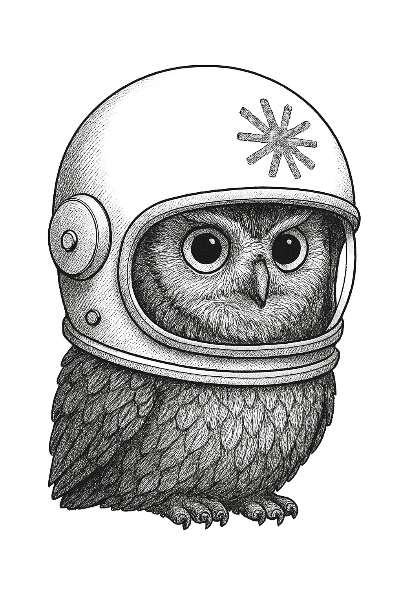

# Swift Anthropic

An unofficial Swift client library for interacting with [Anthropic's API](https://docs.anthropic.com).

## Requirements

- Swift 5.9+
- iOS 16+
- macOS 13+
- watchOS 9+
- tvOS 16+

## Installation

Add the following to your `Package.swift` file:

```swift
Package(
    dependencies: [
        .package(url: "https://github.com/nathanborror/swift-anthropic", branch: "main"),
    ],
    targets: [
        .target(
            name: "YourApp",
            dependencies: [
                .product(name: "Anthropic", package: "swift-anthropic"),
            ]
        ),
    ]
)
```

## Usage

### Chat Completion

```swift
import Anthropic

let client = Client(apiKey: ANTHROPIC_API_KEY)

let req = ChatRequest(
    messages: [.init(text: "Hello, Anthropic!", role: .user)],
    model: "claude-3-7-sonnet-latest"
)

do {
    let response = try await client.chatCompletions(request)
    print(response)
} catch {
    print(error)
}
```

### List models

```swift
import Anthropic

let client = Client(apiKey: ANTHROPIC_API_KEY)

do {
    let response = try await client.models()
    print(response.data.map { $0.id }.joined(separator: "\n"))
} catch {
    print(error)
}
```

### Command Line Interface

```
$ make
$ ./anthropic
OVERVIEW: A utility for interacting with the Anthropic API.

USAGE: anthropic <subcommand>

OPTIONS:
  --version               Show the version.
  -h, --help              Show help information.

SUBCOMMANDS:
  models                  Returns available models.
  chat-completion         Completes a chat request.

  See 'anthropic help <subcommand>' for detailed help.
```
